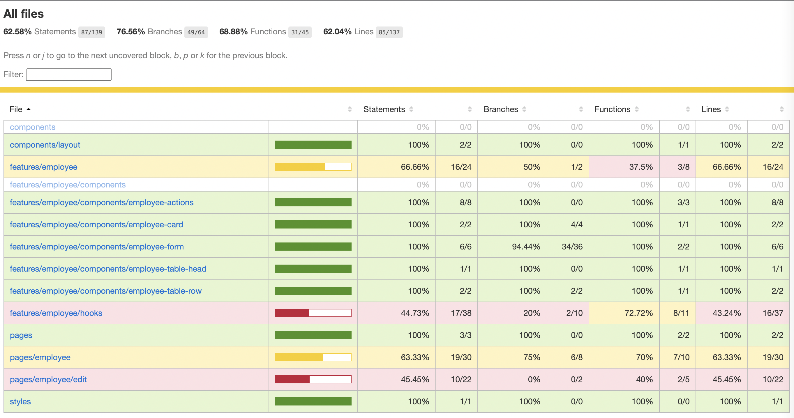

# Swivel-fe project use [Next.js](https://nextjs.org/)

<p align="center">
  <h2 align="center">Typescript, NextJS, mui, formik, Yup, react query, react context, react hooks ⚡️</h2>
</p>




## Features

- ✅ Server-Side Rendering
- ✅ List, Add, Edit, Delete employee
- ✅ Form validation for all employee field
- ✅ E2E test using Cypress

## Structure

This project's structure will look like this:

```
├── components
├── cypress
├── features
├── pages
├── README.md
└── package.json
```

**components**
This is where your common React components will live. Each component will have a directory containing the `.tsx` file

**cypress**
This is where your Cypress test will live.

**features**
This is where your features in your application will live. The feature structure like this:

```
├── <feature_name>
│   ├── components
│   ├── hooks
│   ├── utils
│   ├── <feature_name>.provider.tsx
│   ├── ...
```

**pages**
This is [NestJS](https://nextjs.org/docs/basic-features/pages) page.

## Installation

```bash
$ yarn
```

## Running the app

You need to change the `.env.local.example` to `.env.local` and start the [BE](https://github.com/tamdao/swivel-be) first

```bash
# development
$ yarn dev
```

## Test

```bash
# tests
$ yarn start:ci
$ yarn test
```
